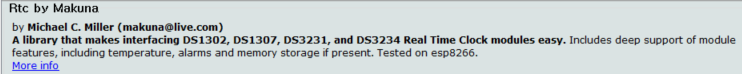

# 아두이노 로켓 추력조절 시스템

## 서론

아두이노를 이용해 하이브리드 로켓 추력을 조절 및 측정하는 시스템입니다.

## 사용 라이브러리

(아두이노 라이브러리 관리 통해서 설치합니다.)

- DS1302사용을 위한 RTC라이브러리

- HX711사용을 위한 라이브러리

  

## 사용 칩셋

- DS1302
- HX711

## 포트구성

0. (시리얼통신을 위해 비워두는것 권장)
1. (시리얼통신을 위해 비워두는것 권장)
2. 트러스트 data
3. 트러스트 clock
4. 트러스트 조정, input
5. 다중벨브, output
6. 다중벨브, output
7. 다중벨브, output
8. 다중벨브, output
9. 다중벨브, output
10. 다중벨브, pwm벨브, output
11. RTC IO
12. RTC SCLK
13. RTC CE

A1. 
A2. 
A3. 
A4. 
A5. 
